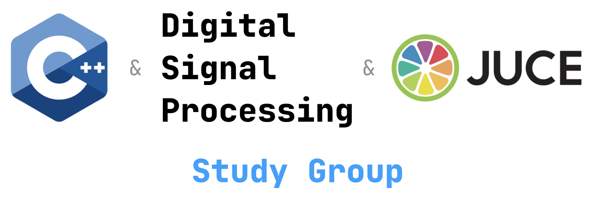
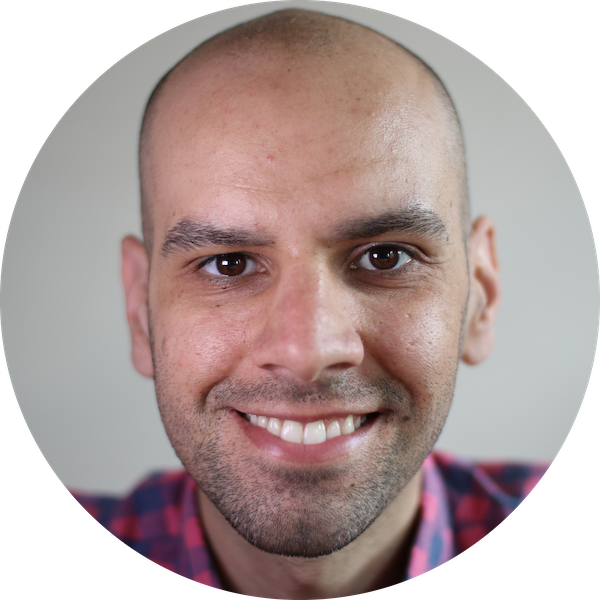
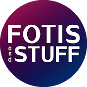

<h3 align="center">
<a href="https://discord.gg/3jWqw4AyuE"><strong>Conversations on Discord</strong></a> ·
<a href="https://www.youtube.com/c/leafac"><strong>Meetings on YouTube</strong></a>
</h3>

# 👉 Join us on [Discord](https://discord.gg/3jWqw4AyuE). Introduce yourself on the #leandro-facchinetti channel.

## What We’ll Cover?

- **The basics of C++.** We’ll start at a pace that’s suitable for beginners and cover only the most essential features of the language, not everything it has to offer—C++ is a big language.

  One the one hand, C++ probably isn’t the best first language for someone new to programming because it’s a complicated language; on the other hand C++ has a lot of educational material, some great development tools, and a big community. And depending on the application, for example, real-time audio processing, C++ is the de-facto standard. In any case, if you’re completely new to programming you should probably ramp up by watching some of [these live-coding sessions](https://www.youtube.com/c/leafac) on JSFX, which you can think of as being a friendlier version of C++.

- **Digital Signal Processing (DSP).** Topics like filters, distortion, compressors, and so forth. The main focus is working with audio, but you’d be surprised to find how much of it transfers to other areas, for example, working with images, video, radars, radio, and so forth.

- **[JUCE](https://juce.com).** This is a framework that many people use to develop audio applications in C++. It helps with some differences between developing for different operating systems and includes some utilities for processing audio and managing graphical user interfaces.

  We have to learn to walk before we can run, so we’ll start focusing on C++ & DSP before we move on to JUCE.

## Timeline

The first meeting is on 2022-02-01, 18:30 UTC, and we don’t have a definite schedule yet. You’re welcome to join later and you may catch up with what we’ve been doing to by [watching the meetings on YouTube](https://www.youtube.com/c/leafac).

## People

<table>
<tr>
<td>

<a href="https://leafac.com">
 
Leandro Facchinetti
</a>

</td>
<td>

<a href="https://www.youtube.com/user/seethisaccount">
 
Fotis
</a>

</td>
</tr>
</table>
